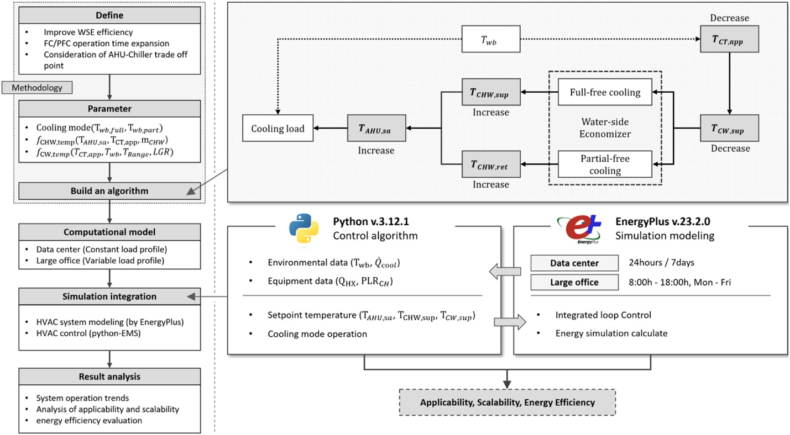
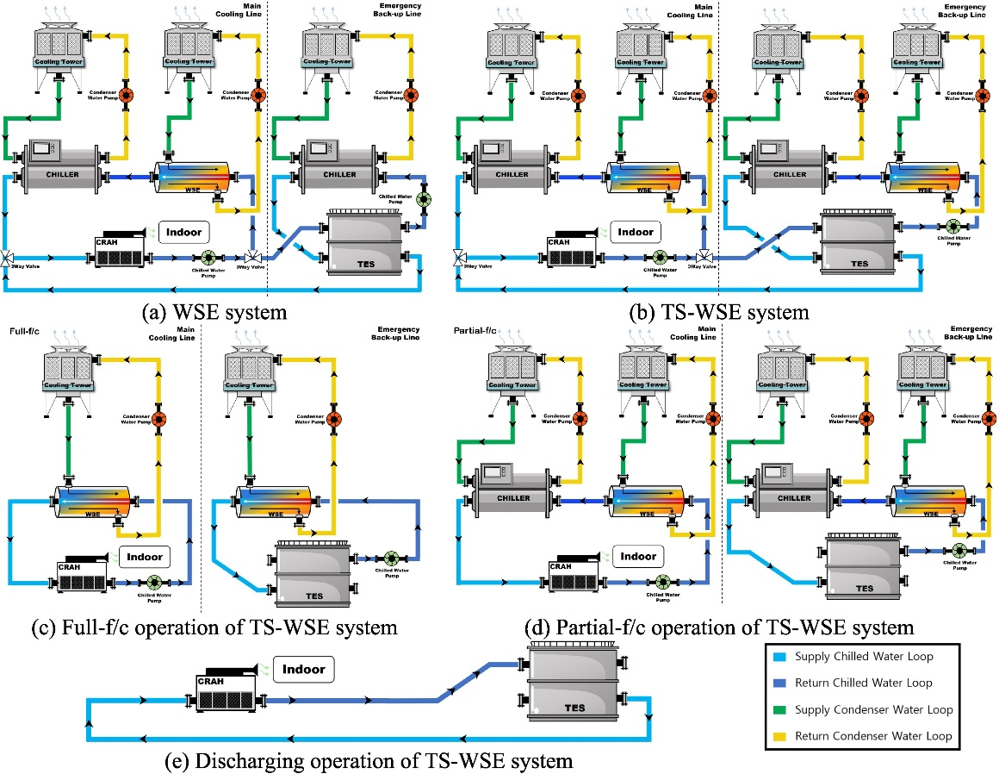
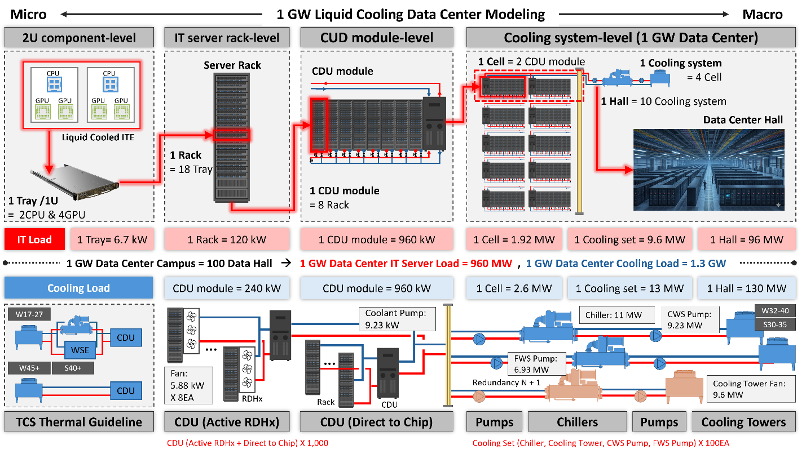
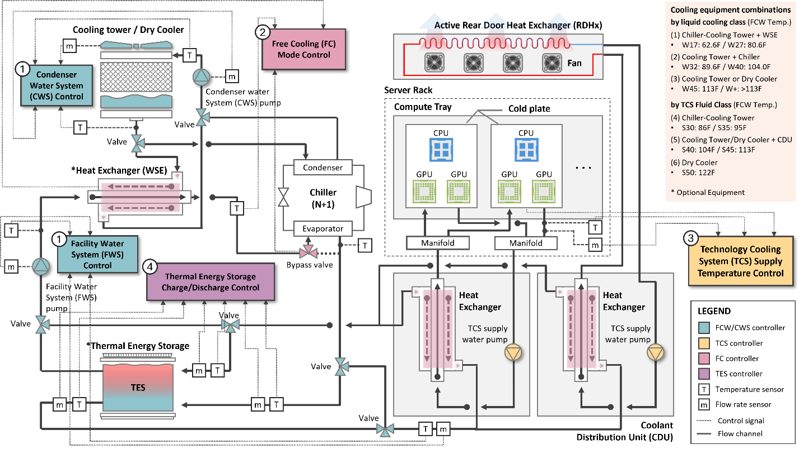

# -BETlab-Data-Center-Modeling

EnergyPlus-based liquid-cooling data center modeling repository for a single cluster interpreted as one chiller-level. Based on ASHRAE 90.4, the indoor environment should remain within the Recommended range of 18 C (64.4 F) to 27 C (80.6 F).

This repository collects large-scale liquid-cooling data center modeling assets, control logic, climate analysis outputs, and final case comparisons for evaluating water-side economizer, chiller, dry-cooler, and TES-integrated operating strategies.

## Visual Overview

*Figure 1. WSE Control Sequence Diagram (Reference [1])*

*Figure 2. Air-cooled Data Center System Schematic Diagram (Reference [4])*

*Figure 3. IT and Cooling Load Modeling*

*Figure 4. System Overview of the Liquid Cooling Data Center*

## Scope

- Baseline IT load: 9.6 MW, constant annual load
- Modeling basis: 1 cluster = 1 chiller-level
- Baseline weather for reported results: Raleigh, NC
- Additional climate package: ASHRAE 90.1 EPW set copied into `WeatherData/ASHRAE901_epw`

## Baseline Weather

| Role | Climate Zone / Representative City | Weather Data |
|---|---|---|
| Baseline | 4A Raleigh, NC | `WeatherData/Baseline_Raleigh/USA_NC_Raleigh-Durham.Intl.AP.723060_TMYx.2009-2023.epw` |

All reported annual result tables and climate-similarity plots use the Raleigh baseline unless noted otherwise.

## Additional Weather Files

Additional EPW files were copied from:
`C:\G36_Semantic_Modeling\ASHRAE901_epw`

Repository location:
`WeatherData/ASHRAE901_epw`

Included files and ASHRAE climate zones, shown in representative-city order:

| Climate Zone and Representative City | Weather Data | Status |
|---|---|---|
| 1A Honolulu, HI (tropical) | `USA_HI_Honolulu.Intl_.AP_.911820_TMY3.epw` | not included |
| 1A Miami, FL | `USA_FL_Miami.Intl_.AP_.722020_TMY3.epw` | included |
| 2A Tampa, FL | `USA_FL_Tampa-MacDill.AFB_.747880_TMY3.epw` | included |
| 2B Tucson, AZ | `USA_AZ_Tucson-Davis-Monthan.AFB_.722745_TMY3.epw` | included |
| 3A Atlanta, GA | `USA_GA_Atlanta-Hartsfield.Jackson.Intl_.AP_.722190_TMY3.epw` | included |
| 3AWH Montgomery, AL | `USA_AL_Montgomery-Dannelly.Field_.722260_TMY3.epw` | not included |
| 3B El Paso, TX | `USA_TX_El.Paso_.Intl_.AP_.722700_TMY3.epw` | included |
| 3C San Diego, CA | `USA_CA_San.Deigo-Brown.Field_.Muni_.AP_.722904_TMY3.epw` | included |
| 4A Raleigh, NC | `USA_NC_Raleigh-Durham.Intl.AP.723060_TMYx.2009-2023.epw` | baseline |
| 4B Albuquerque, NM | `USA_NM_Albuquerque.Intl_.Sunport.723650_TMY3.epw` | included |
| 4C Seattle, WA | `USA_WA_Seattle-Tacoma.Intl_.AP_.727930_TMY3.epw` | included |
| 5A Buffalo, NY | `USA_NY_Buffalo.Niagara.Intl_.AP_.725280_TMY3.epw` | included |
| 5B Denver, CO | `USA_CO_Denver-Aurora-Buckley.AFB_.724695_TMY3.epw` | included |
| 5C Port Angeles, WA | `USA_WA_Port.Angeles-William.R.Fairchild.Intl_.AP_.727885_TMY3.epw` | included |
| 6A Rochester, MN | `USA_MN_Rochester.Intl_.AP_.726440_TMY3.epw` | included |
| 6B Great Falls, MT | `USA_MT_Great.Falls_.Intl_.AP_.727750_TMY3.epw` | included |
| 7 International Falls, MN | `USA_MN_International.Falls_.Intl_.AP_.727470_TMY3.epw` | included |
| 8 Fairbanks, AK | `USA_AK_Fairbanks.Intl_.AP_.702610_TMY3.epw` | included |

Climate zone labels follow the representative-city mapping you provided; for the included climate-similarity set, 4A is represented by Raleigh only.

## Final_Case_01 Climate Set

`Final_Case_01` is used as the EnergyPlus template for hourly outdoor-air comparison across the included climate files. The 4A representative weather is Raleigh only.

| Climate Zone and Representative City | Status for Final_Case_01 graph set |
|---|---|
| 1A Miami, FL | included |
| 2A Tampa, FL | included |
| 2B Tucson, AZ | included |
| 3A Atlanta, GA | included |
| 3B El Paso, TX | included |
| 3C San Diego, CA | included |
| 4A Raleigh, NC | baseline included |
| 4B Albuquerque, NM | included |
| 4C Seattle, WA | included |
| 5A Buffalo, NY | included |
| 5B Denver, CO | included |
| 5C Port Angeles, WA | included |
| 6A Rochester, MN | included |
| 6B Great Falls, MT | included |
| 7 International Falls, MN | included |
| 8 Fairbanks, AK | included |

## Final Cases

The final supply-condition matrix is labeled with `Final_Case` identifiers.

| Final_Case | Supply Class | Mode | Heat rejection type | TCS supply | FWS supply | Model path |
|---|---|---|---|---:|---:|---|
| Final_Case_01 | W40-S45 | A_ChillerOnly | CoolingTower:VariableSpeed (YorkCalc) | 45 C | 40 C | `SupplyClass_W40-S45/A_ChillerOnly/model/LiquidCooling_9_6MW_1Cluster_SupplyClass_W40-S45_A_ChillerOnly.idf` |
| Final_Case_02 | W40-S45 | B1_FullFreeCoolingSwitching | CoolingTower:VariableSpeed (YorkCalc) | 45 C | 40 C | `SupplyClass_W40-S45/B1_FullFreeCoolingSwitching/model/LiquidCooling_9_6MW_1Cluster_SupplyClass_W40-S45_B1_FullFreeCoolingSwitching.idf` |
| Final_Case_03 | W40-S45 | B2_PartialCooling | CoolingTower:VariableSpeed (YorkCalc) | 45 C | 40 C | `SupplyClass_W40-S45/B2_PartialCooling/model/LiquidCooling_9_6MW_1Cluster_SupplyClass_W40-S45_B2_PartialCooling.idf` |
| Final_Case_04 | W40-S45 | C_WSEOnlyTower | CoolingTower:VariableSpeed (YorkCalc) | 45 C | 40 C | `SupplyClass_W40-S45/C_WSEOnlyTower/model/LiquidCooling_9_6MW_1Cluster_SupplyClass_W40-S45_C_WSEOnlyTower.idf` |
| Final_Case_05 | W32-S40 | B1_FullFreeCoolingSwitching | CoolingTower:VariableSpeed (YorkCalc) | 40 C | 32 C | `SupplyClass_W32-S40/B1_FullFreeCoolingSwitching/model/LiquidCooling_9_6MW_1Cluster_SupplyClass_W32-S40_B1_FullFreeCoolingSwitching.idf` |
| Final_Case_06 | W32-S40 | B2_PartialCooling | CoolingTower:VariableSpeed (YorkCalc) | 40 C | 32 C | `SupplyClass_W32-S40/B2_PartialCooling/model/LiquidCooling_9_6MW_1Cluster_SupplyClass_W32-S40_B2_PartialCooling.idf` |
| Final_Case_07 | W32-S40 | C_WSEOnlyTower | CoolingTower:VariableSpeed (YorkCalc) | 40 C | 32 C | `SupplyClass_W32-S40/C_WSEOnlyTower/model/LiquidCooling_9_6MW_1Cluster_SupplyClass_W32-S40_C_WSEOnlyTower.idf` |
| Final_Case_08 | W45-S50 | C_WSEOnlyTower | CoolingTower:VariableSpeed (YorkCalc) | 50 C | 45 C | `SupplyClass_W45-S50/C_WSEOnlyTower/model/LiquidCooling_9_6MW_1Cluster_SupplyClass_W45-S50_C_WSEOnlyTower.idf` |
| Final_Case_09 | W45-S50 | D_DryCoolerTwoSpeed | FluidCooler:TwoSpeed | 50 C | 45 C | `SupplyClass_W45-S50/D_DryCoolerTwoSpeed/model/LiquidCooling_9_6MW_1Cluster_SupplyClass_W45-S50_D_DryCoolerTwoSpeed.idf` |
| Final_Case_10 | Wplus-S50plus | D_DryCoolerTwoSpeed | FluidCooler:TwoSpeed | 55 C | 50 C | `SupplyClass_Wplus-S50plus/D_DryCoolerTwoSpeed/model/LiquidCooling_9_6MW_1Cluster_SupplyClass_Wplus-S50plus_D_DryCoolerTwoSpeed.idf` |

## C Mode YorkCalc Consistency Check

All `C_WSEOnlyTower` final cases were re-checked for the heat rejection object type.

| Final_Case | Supply Class | Mode | CoolingTower:VariableSpeed present | YorkCalc field present | Result |
|---|---|---|---:|---:|---|
| Final_Case_04 | W40-S45 | C_WSEOnlyTower | 1 | 1 | pass |
| Final_Case_07 | W32-S40 | C_WSEOnlyTower | 1 | 1 | pass |
| Final_Case_08 | W45-S50 | C_WSEOnlyTower | 1 | 1 | pass |

## Result Tables

- Final markdown summary:
  `FINAL_CASE_RESULTS.md`
- Final CSV summary:
  `FINAL_CASE_RESULTS.csv`
- Supply-class raw summary:
  `SUPPLY_CLASS_SIMULATION_RESULTS.md`
- Supply-class raw CSV:
  `SUPPLY_CLASS_RESULTS.csv`

## Validation

All final supply-class cases were run as annual EnergyPlus simulations with Raleigh weather.

- `eplusout.err = 0 bytes`
- Severe/Fatal = 0
- Warning = 0
- `.eso` generated for every final case

EnergyPlus returns Windows process code `-1073740791` after writing outputs in this environment, but the simulations completed successfully and produced clean `.err` files.
